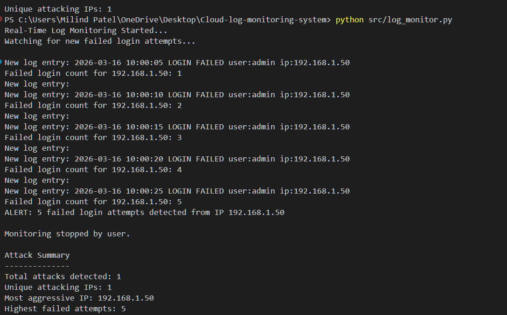
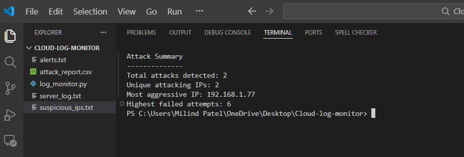
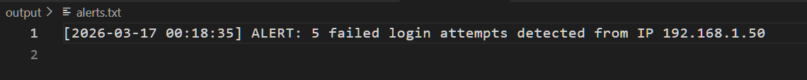
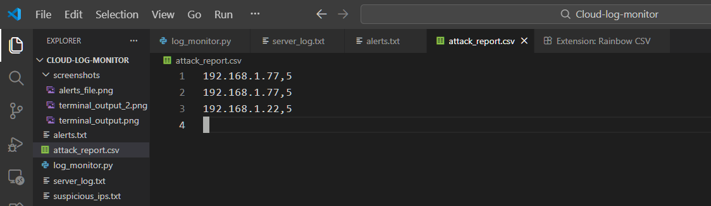

# Cloud Log Monitoring & Alert System

A Python-based security monitoring tool that detects repeated failed login attempts from server logs and generates alerts when suspicious activity is detected.

## Features

- Real-time log monitoring
- Failed login detection
- Threshold-based alert system
- Timestamped security alerts
- CSV attack reporting
- Suspicious IP tracking
- Attack summary statistics

## How It Works

The script continuously monitors a server log file for login activity.  
When multiple failed login attempts are detected from the same IP address, the system triggers an alert and records the attack.

## Technologies Used

- Python
- Regular Expressions
- CSV Logging
- File Monitoring
- Security Log Analysis

## Example Attack Detection

New log entry: 2026-03-14 10:01:13 LOGIN FAILED user:root ip:192.168.1.77
Failed login count for 192.168.1.77: 5
ALERT: 5 failed login attempts detected from IP 192.168.1.77

## Output Files
### alerts.txt
Stores timestamped alerts generated by the monitoring system.
Example:
[2026-03-14 01:10:33] ALERT: 5 failed login attempts detected from IP 192.168.1.77

### attack_report.csv
Logs detected attacks in CSV format.
Example:
192.168.1.77,5
192.168.1.22,5

### suspicious_ips.txt
Stores unique IP addresses that triggered alerts.
Example:
192.168.1.77
192.168.1.22

## Running the Program

Clone the repository or download the files.
Then run:
python log_monitor.py
Stop monitoring by pressing:
Ctrl + C

## System Workflow

1. The script continuously monitors the server log file.
2. Failed login attempts are parsed using regular expressions.
3. The system counts attempts per IP address.
4. When the threshold is reached, an alert is generated.
5. The alert is stored in log files and CSV reports.

## System Demonstration

### Terminal Output
Shows the system detecting repeated failed login attempts and triggering an alert.

---

### Terminal Output (Multiple Attack Detection)
Demonstrates the system detecting attacks from multiple IP addresses and generating an attack summary.

---

### Alerts Log
Displays the timestamped alerts generated when the failed login threshold is exceeded.

---

### Attack Report CSV
Shows the CSV report storing detected attacks with the attacking IP address and number of failed attempts.

